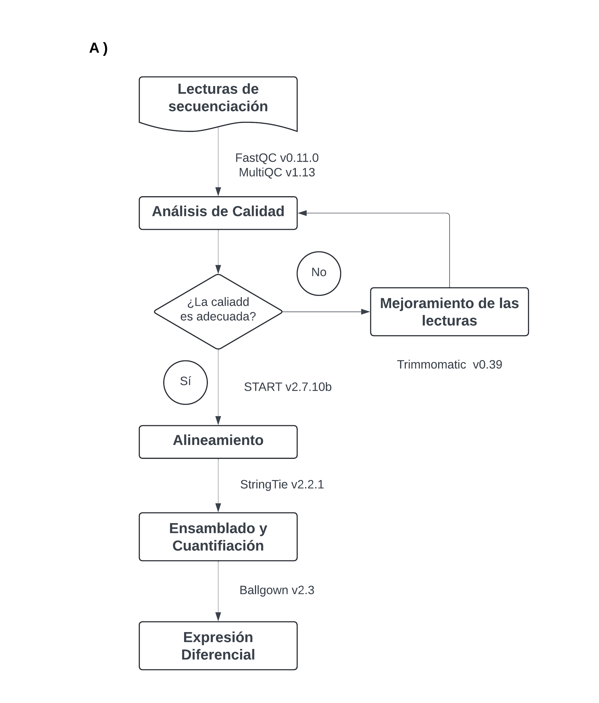

El objetivo  de nuestro análisis es el siguiente: **analizar el perfil trancripcional de los     macrófagos después de un oncoentrenamiento en el microambiente tumoral del cáncer de mama.**

Para ello, hemos estado trabajando con datos RNAseq bulk de tipo pareados. Por cuestiones administrativas tenemos datos de dos lotes de secuenciación independientes. El [primer lote](https://www.dropbox.com/scl/fi/2cqhplg823qp7acbqei64/macs_lote1_fasqtc.html?rlkey=nabuzu7m327ofocs158qbdo0h&st=gix7xet6&dl=0) (Lote 1, *TruSeq RNA sample prep v2 LT*) tiene una calidad adecuada, todas nuestras lecturas (100pb) mostraban una puntuación Phred score mayor a 34 y con un promedio de 28.7 millones de lecturas por biblioteca. Sin embargo, nuestra preocupación viene del [segundo lote](https://www.dropbox.com/scl/fi/fojsefux3vpk486g4e6hv/macs_lote2_fastqc.html?rlkey=6a3rww1596vp0xo9tfcm5bmua&st=j06zj0k7&dl=0) (lote 2 *NovaSeq de Illumina*), cuyas lecturas (150pb) no tienen la misma calidad, en especial las R2. La puntuación Phred para estas lecturas cae hasta 20. En tanto, el R1, cae hasta 22 en la escala Phred. El promedio de lecturas por biblioteca es de 22.7 millones.

Ante el escenario mencionado decidimos hacer [*trimming*](https://www.dropbox.com/scl/fi/ikf7plh4qdrgupxaqn6oc/trimming_macs_lote2_fastqc.html?rlkey=i7vajjwnwnez02k2yrfmpxoi6&st=2dkp0ozj&dl=0) sobre el lote 2, las recortamos a 100 pb, así elevamos la puntuación Phred 27 y 21, para la lectura R1&R2, respectivamente, conservando las 22.7 millones de read en promedio por biblioteca.

Nuestro siguiente paso fue alinear las secuencias de forma independiente con STAR. Para el [lote 1](https://www.dropbox.com/scl/fi/6ed2rs67cvm3ujmv19jer/alignment_macs_lote1.html?rlkey=i9euxzuvnknmu1b371pz6eepx&st=qr15rane&dl=0) obtuvimos un porcentaje de alineamiento único del 92% en promedio para todas las muestras, lo cual nos generó mucha alegría. En tanto el [lote 2](https://www.dropbox.com/scl/fi/vhu9x2bslnou7qmjgqver/alignment_trimming_macs_lote2.html?rlkey=miuu614gv2nyx97g5uju931im&st=zaq83n2a&dl=0), obtuvimos un porcentaje de alineamineto único del 83%, lo cual nos tiene un poco consternados. **Consideramos que la calidad de secuenciación del lote 2 es menor a la obtenida en el lote 1.** 

Posterior al alineamiento, ensamblamos y cuantificamos con Stringtie. Aquí te mostramos el flujo de trabajo:




#### **El asunto en todo es: ¿los datos provenientes del lote 2 son confiables? ¿el segundo lote  de secuenciacióne es viable? ¿puedo homogenizar ambos lotes de secuenciación?**

Lo que pretendemos con los siguientes análisis es homogenizar los datos de secuenación RNAseq, provenientes de dos eventos distintos de secuenciación, para poder hacer comparativas adecuadas. Para ello haremos un PCA para observar el comportamiento, agrupación de los datos y encontrar posibles efectos por lote u otros artefactos. En caso de existir dicho efecto debemos solucionarlo y verificar su resolución mediante otro PCA, en el cual la distribución de los datos debería ser homogena.

**La intención de este análisis es poder homegenizar ambos lotes de secuenciacíon**, considerando que la calidad del lote 1 es mayor a la del lote 2, respecto a las lecturas obtenidas.

Lo primero que necesitamos es instalar las librerías necesarias para realizar el PCA:

```{r}

# Librerias
#install.packages("ggplot2")
library(ggplot2)
#install.packages("ggfortify")
library(ggfortify)

```
Después es **indispensable establecer nuestro directorio de trabajo**. Aquí deben estar todos los archivos y datos de entrada. Además, será el sitio en el cuál se depositen las salidas, es decir, los resultados de nuestros análisis. Para el PCA vamos a trabajar con los datos de expresión normalizados en FPKM.

```{r}

# Cargar datos
setwd("D:/marval_windows/JR_MARVAL/himfg/maestria/rnaseq_macrophage/DEA_ballgown_5_all_samples/batch/batch_rnaseq")
list.files()
data <- read.table(file = "fpkm_all_samples_with_genes_wiso_mean_L1.csv", sep = ",", head=T, row.names = 1)
head(data)

```
Ahora debemos trabajar un poco los datos. Primero habrá que remover los genes que no se encuentren expresados en ninguna de las condiciones. Para ello, si la suma de la fila es igual a 0, entonces se elimina dicha fila (en transcriptoma no hay problema con eliminar transcritos). También debemos transponer el dataframe, para que sea compatible con la librería.

```{r}
# Eliminar filas cuya suma sea 0
data <- data[!(rowSums(data[,]) == 0), ]
# Transponer dataframe
df_tras = data.frame(t(data[,]))
```

Ahora seguimos propiamente con el **Análisis de Componentes Principales**. En primer lugar, analizamos los datos del lote 1. Estos datos se ensamblaron y cuantificaron de forma independiente al lote 2. Es importante considerar que parte de los argumentos para contruir el PCA, es centrar y escalar los datos, lo cual afecta la forma en que se comporta la varianza. 

```{r}

# PCA
df <- prcomp(df_tras[,c(1:7652)], center = T, scale. = T)
summary(df)

```
El resultado del PCA podemos guardarlo como un dataframe:

```{r}

# Realizar el análisis de componentes principales
pca_result <- prcomp(df_tras[, c(1:7652)], center = T, scale. = T)
# Crear un data frame con los resultados del PCA
pca_data <- as.data.frame(pca_result$x)
head(pca_data)

```
Ahora vamos a representar gráficamente nuestros resultado. Para ello nombraremos nuestras muestras por condición, excluyendo su número de replica para que sea más fácil la unificación. 

```{r}
# Funcion para asignar las etiquetas
assign_label <- function(cond_name) {
  if (grepl("^basal_", cond_name)) {
    return("Monocyte")
  } else if (grepl("^gmcsf_", cond_name)) {
    return("Macrophage GM-CSF")
  } else if (grepl("^uivc_hs", cond_name)) {
    return("HS578T")
  } else if (grepl("^mcf7_", cond_name)) {
    return("MCF7")
  } else if (grepl("^mda231_", cond_name)) {
    return("MDA-MB-231")
  } else if (grepl("^uivc_p16_", cond_name)) {
    return("MBCDF-16")
  } else if (grepl("^t47d_", cond_name)) {
    return("T47D")
  } else if (grepl("^uivc_160_", cond_name)) {
    return("UIVC-IDC-2")
  } else if (grepl("^uivc_169_", cond_name)) {
    return("UIVC-IDC-3")
  } else if (grepl("^uivc_172_", cond_name)) {
    return("UIVC-IDC-1b")
  } else if (grepl("^uivc_183_", cond_name)) {
    return("UIVC-IDC-9")
  } else if (grepl("^uivc1_", cond_name)) {
    return("UIVC-IDC-1")
  } else if (grepl("^uivc4_", cond_name)) {
    return("UIVC-IDC-4")
  } else {
    return("Other")  # Añadir un caso para cualquier otra condición
  }
}


# Agregar la condición desde los nombres de las columnas
pca_data$Condicion <- sapply(rownames(df_tras), assign_label)


# Agregar la condición desde los nombres de las columnas
pca_data$Condicion <- sapply(rownames(df_tras), function(cond_name) {
  assign_label(cond_name)
})

# Graficar
ggplot(pca_data, aes(x = PC1, y = PC2, color = Condicion)) +
  geom_point(size = 4) +
  labs(x = paste("PC1", round(summary(pca_result)$importance[2,1] * 100, 2), "%"), 
       y = paste("PC2", round(summary(pca_result)$importance[2,2] * 100, 2), "%")) +
  theme_classic() +
  scale_color_manual(name = "Cell type",
                     values = c("Monocyte" = "blue", 
                                "Macrophage GM-CSF" = "red", 
                                "HS578T" = "green", 
                                "MCF7" = "orange", 
                                "MDA-MB-231" = "purple", 
                                "MBCDF-16" = "brown", 
                                "T47D" = "pink", 
                                "UIVC-IDC-2" = "cyan", 
                                "UIVC-IDC-3" = "magenta", 
                                "UIVC-IDC-1b" = "yellow", 
                                "UIVC-IDC-9" = "salmon", 
                                "UIVC-IDC-1" = "darkblue", 
                                "UIVC-IDC-4" = "violetred"))

```

Como podemos ver, los dos primeros componentes no explican ni el 50% de la varianza de los datos, esto seguramente porque centramos y escalamos los datos.Sin embargo, no es necesario marcar estos parametros pues todos los datos son valores de expresión que se normalizaron juntos, es decir, son la misma unidad en la misma magnitud, entonces **no es necesario centrar ni escalar los datos.**

```{r}

# PCA
df <- prcomp(df_tras[,c(1:7652)], center = F, scale. = F)
summary(df)

```
```{r}

# Realizar el análisis de componentes principales
pca_result <- prcomp(df_tras[, c(1:7652)], center = F, scale. = F)
# Crear un data frame con los resultados del PCA
pca_data <- as.data.frame(pca_result$x)
head(pca_data)

```

```{r}
# Funcion para asignar las etiquetas
assign_label <- function(cond_name) {
  if (grepl("^basal_", cond_name)) {
    return("Monocyte")
  } else if (grepl("^gmcsf_", cond_name)) {
    return("Macrophage GM-CSF")
  } else if (grepl("^uivc_hs", cond_name)) {
    return("HS578T")
  } else if (grepl("^mcf7_", cond_name)) {
    return("MCF7")
  } else if (grepl("^mda231_", cond_name)) {
    return("MDA-MB-231")
  } else if (grepl("^uivc_p16_", cond_name)) {
    return("MBCDF-16")
  } else if (grepl("^t47d_", cond_name)) {
    return("T47D")
  } else if (grepl("^uivc_160_", cond_name)) {
    return("UIVC-IDC-2")
  } else if (grepl("^uivc_169_", cond_name)) {
    return("UIVC-IDC-3")
  } else if (grepl("^uivc_172_", cond_name)) {
    return("UIVC-IDC-1b")
  } else if (grepl("^uivc_183_", cond_name)) {
    return("UIVC-IDC-9")
  } else if (grepl("^uivc1_", cond_name)) {
    return("UIVC-IDC-1")
  } else if (grepl("^uivc4_", cond_name)) {
    return("UIVC-IDC-4")
  } else {
    return("Other")  # Añadir un caso para cualquier otra condición
  }
}


# Agregar la condición desde los nombres de las columnas
pca_data$Condicion <- sapply(rownames(df_tras), assign_label)


# Agregar la condición desde los nombres de las columnas
pca_data$Condicion <- sapply(rownames(df_tras), function(cond_name) {
  assign_label(cond_name)
})

# Graficar
ggplot(pca_data, aes(x = PC1, y = PC2, color = Condicion)) +
  geom_point(size = 4) +
  labs(x = paste("PC1", round(summary(pca_result)$importance[2,1] * 100, 2), "%"), 
       y = paste("PC2", round(summary(pca_result)$importance[2,2] * 100, 2), "%")) +
  theme_classic() +
  scale_color_manual(name = "Cell type",
                     values = c("Monocyte" = "blue", 
                                "Macrophage GM-CSF" = "red", 
                                "HS578T" = "green", 
                                "MCF7" = "orange", 
                                "MDA-MB-231" = "purple", 
                                "MBCDF-16" = "brown", 
                                "T47D" = "pink", 
                                "UIVC-IDC-2" = "cyan", 
                                "UIVC-IDC-3" = "magenta", 
                                "UIVC-IDC-1b" = "yellow", 
                                "UIVC-IDC-9" = "salmon", 
                                "UIVC-IDC-1" = "darkblue", 
                                "UIVC-IDC-4" = "violetred"))

```

Como podemos observar la varianza explicada por el PC1 es muy alta, más del 90%. Si bien observamos la distribución esperada de las muestras, creo que este porcentaje es muy alto, incluso considerando que estamos trabajando con los monocitos lo cuál es una variable biológica importante a considerar **¿Cómo se ve el análisis si excluimos a los monocitos?**

```{r}

# Cargar datos
setwd("D:/marval_windows/JR_MARVAL/himfg/maestria/rnaseq_macrophage/DEA_ballgown_5_all_samples/batch/batch_rnaseq")
list.files()
data <- read.table(file = "fpkm_macs_with_genes_wiso_mean_L1.csv", sep = ",", head=T, row.names = 1)
head(data)

```
```{r}
# Eliminar filas cuya suma sea 0
data <- data[!(rowSums(data[,]) == 0), ]
# Transponer dataframe
df_tras = data.frame(t(data[,]))
```

```{r}

# PCA
df <- prcomp(df_tras[,c(1:7640)], center = F, scale. = F)
summary(df)

```

```{r}

# Realizar el análisis de componentes principales
pca_result <- prcomp(df_tras[, c(1:7640)], center = F, scale. = F)
# Crear un data frame con los resultados del PCA
pca_data <- as.data.frame(pca_result$x)
head(pca_data)

```
```{r}
# Funcion para asignar las etiquetas
assign_label <- function(cond_name) {
  if (grepl("^basal_", cond_name)) {
    return("Monocyte")
  } else if (grepl("^gmcsf_", cond_name)) {
    return("Macrophage GM-CSF")
  } else if (grepl("^uivc_hs", cond_name)) {
    return("HS578T")
  } else if (grepl("^mcf7_", cond_name)) {
    return("MCF7")
  } else if (grepl("^mda231_", cond_name)) {
    return("MDA-MB-231")
  } else if (grepl("^uivc_p16_", cond_name)) {
    return("MBCDF-16")
  } else if (grepl("^t47d_", cond_name)) {
    return("T47D")
  } else if (grepl("^uivc_160_", cond_name)) {
    return("UIVC-IDC-2")
  } else if (grepl("^uivc_169_", cond_name)) {
    return("UIVC-IDC-3")
  } else if (grepl("^uivc_172_", cond_name)) {
    return("UIVC-IDC-1b")
  } else if (grepl("^uivc_183_", cond_name)) {
    return("UIVC-IDC-9")
  } else if (grepl("^uivc1_", cond_name)) {
    return("UIVC-IDC-1")
  } else if (grepl("^uivc4_", cond_name)) {
    return("UIVC-IDC-4")
  } else {
    return("Other")  # Añadir un caso para cualquier otra condición
  }
}


# Agregar la condición desde los nombres de las columnas
pca_data$Condicion <- sapply(rownames(df_tras), assign_label)


# Agregar la condición desde los nombres de las columnas
pca_data$Condicion <- sapply(rownames(df_tras), function(cond_name) {
  assign_label(cond_name)
})

# Graficar
ggplot(pca_data, aes(x = PC1, y = PC2, color = Condicion)) +
  geom_point(size = 4) +
  labs(x = paste("PC1", round(summary(pca_result)$importance[2,1] * 100, 2), "%"), 
       y = paste("PC2", round(summary(pca_result)$importance[2,2] * 100, 2), "%")) +
  theme_classic() +
  scale_color_manual(name = "Cell type",
                     values = c("Monocyte" = "blue", 
                                "Macrophage GM-CSF" = "red", 
                                "HS578T" = "green", 
                                "MCF7" = "orange", 
                                "MDA-MB-231" = "purple", 
                                "MBCDF-16" = "brown", 
                                "T47D" = "pink", 
                                "UIVC-IDC-2" = "cyan", 
                                "UIVC-IDC-3" = "magenta", 
                                "UIVC-IDC-1b" = "yellow", 
                                "UIVC-IDC-9" = "salmon", 
                                "UIVC-IDC-1" = "darkblue", 
                                "UIVC-IDC-4" = "violetred"))

```

Si solo contemplamos los macrófagos el procentaje explicado por el PC1 sigue sinedo muy elevado, lo cual no necesariamente es algo bueno.

**En teoría estos datos me dan confizan porque el lote 1 tiene una gran calidad de secueciación y alineamiento. Pero los porcentajes tan altos del PCA me hacen mucho ruído... ¿Qué está pasando?**

Ahora vamos integrar el lote 2 a nuestro análisis. En este punto tomé ambos lotes de secuecuaciación y los ensamble y cuantifiqué juntos, para que la normalización fuera homogénea. 

```{r}

# Cargar datos
setwd("D:/marval_windows/JR_MARVAL/himfg/maestria/rnaseq_macrophage/DEA_ballgown_5_all_samples/batch/batch_rnaseq")
list.files()
data <- read.table(file = "fpkm_all_samples_with_genes_wiso_mean_L1&2.csv", sep = ",", head=T, row.names = 1)
head(data)

```
```{r}

# Eliminar filas cuya suma sea 0
data <- data[!(rowSums(data[,]) == 0), ]
# Transponer dataframe
df_tras = data.frame(t(data[,]))

```

Ahora construimos el PCA considerando ambos lotes de secuenciación. Primero lo haremos con los **datos centrados y escalados:**

```{r}

# PCA
df <- prcomp(df_tras[,c(1:8663)], center = T, scale. = T)
summary(df)

```
```{r}

# Realizar el análisis de componentes principales
pca_result <- prcomp(df_tras[, c(1:8663)], center = T, scale. = T)
# Crear un data frame con los resultados del PCA
pca_data <- as.data.frame(pca_result$x)
head(pca_data)

```

Ahora vamos a representar gráficamente nuestros resultado. Para ello nombraremos nuestras muestras por condición, excluyendo su número de replica para que sea más fácil la unificación. Además, pondremos una etiqueta para identificar el lote al que pertenece cada muestra.

```{r}
# Función para asignar las etiquetas
assign_label <- function(cond_name) {
  if (grepl("^basal_", cond_name)) {
    return("Monocyte")
  } else if (grepl("^gmcsf_", cond_name)) {
    return("Macrophage GM-CSF")
  } else if (grepl("^uivc_hs", cond_name)) {
    return("HS578T")
  } else if (grepl("^mcf7_", cond_name)) {
    return("MCF7")
  } else if (grepl("^mda231_", cond_name)) {
    return("MDA-MB-231")
  } else if (grepl("^uivc_p16_", cond_name)) {
    return("MBCDF-16")
  } else if (grepl("^t47d_", cond_name)) {
    return("T47D")
  } else if (grepl("^uivc_160_", cond_name)) {
    return("UIVC-IDC-2")
  } else if (grepl("^uivc_169_", cond_name)) {
    return("UIVC-IDC-3")
  } else if (grepl("^uivc_172_", cond_name)) {
    return("UIVC-IDC-1b")
  } else if (grepl("^uivc_183_", cond_name)) {
    return("UIVC-IDC-9")
  } else if (grepl("^uivc1_", cond_name)) {
    return("UIVC-IDC-1a")
  } else if (grepl("^uivc4_", cond_name)) {
    return("UIVC-IDC-4")
  } else {
    return("Other")
  }
}

# Función para asignar el lote
assign_batch <- function(cond_name) {
  lote1 <- c("Monocyte", "Macrophage GM-CSF", "MCF7", "MDA-MB-231", "T47D", "UIVC-IDC-1a", "UIVC-IDC-4")
  if (assign_label(cond_name) %in% lote1) {
    return("Batch 1")
  } else {
    return("Batch 2")
  }
}

# Agregar las columnas 'Condicion' y 'Lote' al marco de datos PCA
pca_data$Condicion <- sapply(rownames(df_tras), assign_label)
pca_data$Lote <- sapply(rownames(df_tras), assign_batch)

# Graficar el PCA con colores para las condiciones y formas para los lotes
ggplot(pca_data, aes(x = PC1, y = PC2, color = Condicion, shape = Lote)) +
  geom_point(size = 4) +
  labs(x = paste("PC1", round(summary(pca_result)$importance[2,1] * 100, 2), "%"), 
       y = paste("PC2", round(summary(pca_result)$importance[2,2] * 100, 2), "%")) +
  theme_classic() +
  scale_color_manual(name = "Cell type",
                     values = c("Monocyte" = "blue", 
                                "Macrophage GM-CSF" = "red", 
                                "HS578T" = "green", 
                                "MCF7" = "orange", 
                                "MDA-MB-231" = "purple", 
                                "MBCDF-16" = "brown", 
                                "T47D" = "pink", 
                                "UIVC-IDC-2" = "cyan", 
                                "UIVC-IDC-3" = "magenta", 
                                "UIVC-IDC-1b" = "chocolate",
                                "UIVC-IDC-9" = "salmon", 
                                "UIVC-IDC-1a" = "darkblue", 
                                "UIVC-IDC-4" = "violetred")) +
  scale_shape_manual(name = "Batch",
                     values = c("Batch 1" = 16,  # Cuadrado
                                "Batch 2" = 17))  # Triángulo

```

En este gráfico podemos observar un posible efecto de lote. Para solucionarlo, el primer abordaje consiste en no centrar ni escalar los datos, dado que todos están medidos en la misma unidad de transcripción FPKM y por ende normalizados. El análisis de los datos sin centrar ni escalar viene a continuación.

### **Análisis de Componentes Principales y Efecto de Lote**

Los datos necesarios para construir este análsis son los mismos que usamos anteriormente, solo cambian los argumentos del algoritmo a *False* para no centrar ni escalar los datos. 

```{r}

# PCA
df <- prcomp(df_tras[,c(1:8663)], center = F, scale. = F)
summary(df)

```
```{r}

# Realizar el análisis de componentes principales
pca_result <- prcomp(df_tras[, c(1:8663)], center = F, scale. = F)
# Crear un data frame con los resultados del PCA
pca_data <- as.data.frame(pca_result$x)
head(pca_data)

```
```{r}
# Función para asignar las etiquetas
assign_label <- function(cond_name) {
  if (grepl("^basal_", cond_name)) {
    return("Monocyte")
  } else if (grepl("^gmcsf_", cond_name)) {
    return("Macrophage GM-CSF")
  } else if (grepl("^uivc_hs", cond_name)) {
    return("HS578T")
  } else if (grepl("^mcf7_", cond_name)) {
    return("MCF7")
  } else if (grepl("^mda231_", cond_name)) {
    return("MDA-MB-231")
  } else if (grepl("^uivc_p16_", cond_name)) {
    return("MBCDF-16")
  } else if (grepl("^t47d_", cond_name)) {
    return("T47D")
  } else if (grepl("^uivc_160_", cond_name)) {
    return("UIVC-IDC-2")
  } else if (grepl("^uivc_169_", cond_name)) {
    return("UIVC-IDC-3")
  } else if (grepl("^uivc_172_", cond_name)) {
    return("UIVC-IDC-1b")
  } else if (grepl("^uivc_183_", cond_name)) {
    return("UIVC-IDC-9")
  } else if (grepl("^uivc1_", cond_name)) {
    return("UIVC-IDC-1a")
  } else if (grepl("^uivc4_", cond_name)) {
    return("UIVC-IDC-4")
  } else {
    return("Other")
  }
}

# Función para asignar el lote
assign_batch <- function(cond_name) {
  lote1 <- c("Monocyte", "Macrophage GM-CSF", "MCF7", "MDA-MB-231", "T47D", "UIVC-IDC-1a", "UIVC-IDC-4")
  if (assign_label(cond_name) %in% lote1) {
    return("Batch 1")
  } else {
    return("Batch 2")
  }
}

# Agregar las columnas 'Condicion' y 'Lote' al marco de datos PCA
pca_data$Condicion <- sapply(rownames(df_tras), assign_label)
pca_data$Lote <- sapply(rownames(df_tras), assign_batch)

# Graficar el PCA con colores para las condiciones y formas para los lotes
ggplot(pca_data, aes(x = PC1, y = PC2, color = Condicion, shape = Lote)) +
  geom_point(size = 4) +
  labs(x = paste("PC1", round(summary(pca_result)$importance[2,1] * 100, 2), "%"), 
       y = paste("PC2", round(summary(pca_result)$importance[2,2] * 100, 2), "%")) +
  theme_classic() +
  scale_color_manual(name = "Cell type",
                     values = c("Monocyte" = "blue", 
                                "Macrophage GM-CSF" = "red", 
                                "HS578T" = "green", 
                                "MCF7" = "orange", 
                                "MDA-MB-231" = "purple", 
                                "MBCDF-16" = "brown", 
                                "T47D" = "pink", 
                                "UIVC-IDC-2" = "cyan", 
                                "UIVC-IDC-3" = "magenta", 
                                "UIVC-IDC-1b" = "chocolate",
                                "UIVC-IDC-9" = "salmon", 
                                "UIVC-IDC-1a" = "darkblue", 
                                "UIVC-IDC-4" = "violetred")) +
  scale_shape_manual(name = "Batch",
                     values = c("Batch 1" = 16,  # Cuadrado
                                "Batch 2" = 17))  # Triángulo

```

Con este gráfico vemos una mejor armonía entre los macrófagos entrenados por el Microambiente Tumoral (TME), de ambos lotes de secuenciación. **Además, la variación explicada por el PC1 es mucho mayor, tan mayor que preocua que lo que este explicando el PC1 sea el efecto por lote ¿esto es posible?**

Pero aún notamos una mayor dispersión entre las replicas del lote 2, por ello queremos realizar la correción por lote. Lo siguiente es representar un PCA por lotes y ver si en verdad existe este efecto y de ser así solucionarlo. Ahora lo que debemos hacer es añadir la etiqueta de lote a cada una nuestras muestras según corresponda:

```{r}

# Crear un vector de lotes
batch_info <- c("Batch_1", "Batch_1", "Batch_1", "Batch_1", "Batch_1", "Batch_1",
                "Batch_1", "Batch_1", "Batch_1", "Batch_1", "Batch_1", "Batch_1",
                "Batch_2", "Batch_2", "Batch_2", "Batch_2", "Batch_2", "Batch_2",
                "Batch_1", "Batch_1", "Batch_1", "Batch_1", "Batch_1", 
                "Batch_1", "Batch_1", "Batch_1", "Batch_1", "Batch_1", "Batch_1",
                "Batch_2", "Batch_2", "Batch_2", "Batch_2", "Batch_2", "Batch_2",
                "Batch_1", "Batch_1", "Batch_1", "Batch_1", "Batch_1", 
                "Batch_2", "Batch_2", "Batch_2", "Batch_2", "Batch_2", "Batch_2",
                "Batch_2", "Batch_2", "Batch_2", "Batch_2", "Batch_2", "Batch_2",
                "Batch_2", "Batch_2", "Batch_2", "Batch_2", "Batch_2", "Batch_2",
                 "Batch_2", "Batch_2", "Batch_2", "Batch_2", "Batch_2", "Batch_2", 
                "Batch_1", "Batch_1", "Batch_1", "Batch_1", "Batch_1", "Batch_1",
                "Batch_1", "Batch_1", "Batch_1", "Batch_1", "Batch_1")

# Añadir la información del lote al dataframe transpuesto
df_tras$lote <- batch_info

# Verificar efectos de lote con PCA
# Hacer el PCA sin considerar la última columna (lote)
pca_result <- prcomp(df_tras[, -ncol(df_tras)], center = FALSE, scale. = FALSE)
# Convertir el PCA en un dataframe
pca_data <- as.data.frame(pca_result$x)
# Añadir la columna lote al dataframe del PCA
pca_data$lote <- df_tras$lote

# Crear una tabla de relación
tabla_relacion <- data.frame(Muestra = rownames(df_tras), Lote = df_tras$lote)

# Graficar PCA coloreado por lote
ggplot(pca_data, aes(x = PC1, y = PC2, color = lote)) +
  geom_point(size = 4) +
  labs(x = paste("PC1", round(summary(pca_result)$importance[2, 1] * 100, 2), "%"), 
       y = paste("PC2", round(summary(pca_result)$importance[2, 2] * 100, 2), "%")) +
  theme_classic() +
  scale_color_manual(name = "Batch",
                     values = c("Batch_1" = "purple", "Batch_2" = "blue"))

```

Ahora lo siguiente es raealizar la corrección por lote con la herramienta [ComBat-seq](https://github.com/zhangyuqing/ComBat-seq?tab=readme-ov-file).

---

### **Algoritmo de Jerarquización**
 
En esta sección visualizaremos los dato mediante mapas de calor con la intención de observar como se están agrupando los datos. Las librerías a utilizar son:

```{r}

#install.packages("pheatmap")
library(pheatmap)
#install.packages("ggplot2")
library(ggplot2)
#install.packages("colorspace")
library(colorspace)
#install.packages("grid")
library(grid)
#install.packages("RColorBrewer")
library(RColorBrewer)

```
Primero vamos a visualizar los datos del **lote 1:**

```{r}

# Cargar datos
setwd("D:/marval_windows/JR_MARVAL/himfg/maestria/rnaseq_macrophage/DEA_ballgown_5_all_samples/batch/batch_rnaseq")
list.files()
data <- read.table(file = "fpkm_all_samples_with_genes_wiso_mean_L1_median.csv", sep = ",", head=T)
head(data)

```
Ahora vamos a trabajr un poco los datos. Primero vamos a eliminar los genes que no se expresan en ninguna de las condiciones experimentales. Y después devemmos transdormar nuestro dataframe en una matriz:

```{r}

data <- data[!(rowSums(data[, -1]) == 0), ]
rownames(data) <- data[,1]
samp2 <- data[,-1]
mat_data <- data.matrix(samp2[,1:ncol(samp2)])
colnames(data)

```
Para que nuestra heatmap muestre el nombre de las condicones experimentales necesitamos agregar las etiquetas necesarias:

```{r}

# Crear el DataFrame de anotaciones de columnas
my_sample_col <- data.frame(
  condition = factor(colnames(mat_data), levels = c("Monocyte", "Macrophage_GM_CSF", "MCF7", 
                                                   "MDA_MB_231", "T47D", "UIVC_IDC_1a",
                                                   "UIVC_IDC_4")))

row.names(my_sample_col) <- colnames(mat_data)


# Definir los colores para las anotaciones
my_colour <- list(
  condition = c(Monocyte = "blue",  Macrophage_GM_CSF = "red", MCF7 = "orange",
                MDA_MB_231 = "purple", T47D = "pink", UIVC_IDC_1a = "darkblue", 
                UIVC_IDC_4 = "violetred"))

```

Ahora si podemos generar el mapa de calor:

```{r}

pheatmap(mat_data,
         color= colorRampPalette(c("blue", "black", "red"))(100),
         fontsize_col = 8,
         fontsize_row = 8,
         show_rownames = F,
         show_colnames = F,
         cluster_rows = T,
         cluster_cols = T,
         border_color = "grey",
         scale = "row", 
         cellwidth = 10,
         legend = T,
         annotation_legend = T,
         treeheight_col = 40,
         annotation_col = my_sample_col,
         annotation_colors = my_colour,
         annotation_names_col = T
)

```

Ahora veamos en mapa de calor de ambos lotes:

```{r}

# Cargar datos
setwd("D:/marval_windows/JR_MARVAL/himfg/maestria/rnaseq_macrophage/DEA_ballgown_5_all_samples/batch/batch_rnaseq")
list.files()
data <- read.table(file = "fpkm_all_samples_with_genes_wiso_mean_L1&2_median.csv", sep = ",", head=T)
head(data)

```
```{r}

data <- data[!(rowSums(data[, -1]) == 0), ]
rownames(data) <- data[,1]
samp2 <- data[,-1]
mat_data <- data.matrix(samp2[,1:ncol(samp2)])
colnames(data)

```
```{r}

# Crear el DataFrame de anotaciones de columnas
my_sample_col <- data.frame(
  condition = factor(colnames(mat_data), levels = c("Monocyte", "Macrophage_GM_CSF", "MCF7", 
                                                   "MDA_MB_231", "T47D", "UIVC_IDC_1a",
                                                   "UIVC_IDC_4", "UIVC_IDC_9",
                                                   "HS578T", "MBCDF_16",  "UIVC_IDC_2",
                                                    "UIVC_IDC_3", "UIVC_IDC_1b" )))

row.names(my_sample_col) <- colnames(mat_data)


# Definir los colores para las anotaciones
my_colour <- list(
  condition = c(Monocyte = "blue",  Macrophage_GM_CSF = "red", HS578T = "green", MCF7 = "orange",
                MDA_MB_231 = "purple", MBCDF_16 = "brown", T47D = "pink",
                UIVC_IDC_2 = "cyan", UIVC_IDC_3 = "magenta", UIVC_IDC_1b = "chocolate",
                UIVC_IDC_9 = "salmon", UIVC_IDC_1a = "darkblue", UIVC_IDC_4 = "violetred"))

```

Ahora si podemos generar el mapa de calor:

```{r}

pheatmap(mat_data,
         color= colorRampPalette(c("blue", "black", "red"))(100),
         fontsize_col = 8,
         fontsize_row = 8,
         show_rownames = F,
         show_colnames = F,
         cluster_rows = T,
         cluster_cols = T,
         border_color = "grey",
         scale = "row", 
         cellwidth = 10,
         legend = T,
         annotation_legend = T,
         treeheight_col = 40,
         annotation_col = my_sample_col,
         annotation_colors = my_colour,
         annotation_names_col = T
)

```

El heatmap muestra un claro efecto por lote... ¿Cómo se transforman los valores del PCA para poder usarlos en la construcción del mapa de calor?


```{r}
sessionInfo()
```
