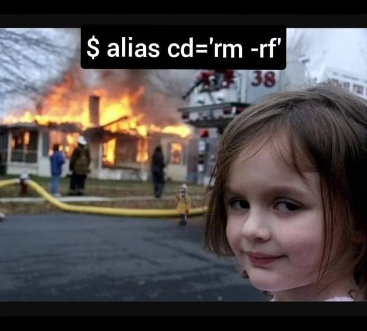

# **Control de Calidad en datos de secuenciación masiva**

El primer paso al recibir nuestros datos de secuenciación es evaluar su calidad, es decir, que el proceso de secuenciación fue adecuado. Para ello utilizamos la herramienta [FastQC](https://www.bioinformatics.babraham.ac.uk/projects/fastqc/) y [MultiQC](https://seqera.io/multiqc/). Existen diversos parámetros que se evaluan para determinar la calidad del evento de secuenciación, por lo cual es importante conocerlos para realizar una correcta interpretación del reporte de calidad.

Para abordar este ejercico de un manera más formal, hay que realziar varios pasos:

+ **Instala** [Miniconda](https://www.anaconda.com/docs/getting-started/miniconda/main) para la gestión de paquetes y crea tu primer entorno que contenga las herramients necesarias para este análisis. Puedes consultar esta [guía](https://docs.conda.io/projects/conda/en/latest/user-guide/getting-started.html#managing-python) para aprender a manejar entornos.

+ Obtener un conjunto de **muestras RNAseq bulk de tipo *pair-end* con triplicado biológico (control vs problema)** las cuales nos servirán para simular nuestros análisis y establecer el flujo de trabajo. Estas muestras se pueden obtener de repositorios como *NCBI*, *GEO* o incluso Github.

+ **Crea una versión reducida de las muestras originales**. Para poder ejecutar los ejercicios en una computadora personal es recomendable reducir el tamaño de los archivos, no comprimiéndolos, sino seleccionando una porción de las lecturas para generar archivos '.fastq' más ligeros

+ **Realiza el análisis de calidad con FastQC y MultiQC** sobre los datos de prueba. Diseña e implementa un script que automatice este proceso. Considera el uso del comando *nohup*.

**Investiga:**

+ ¿Cómo puedes exportar tu ambiente Conda? ¿Cuál es el valor de hacer eso?

+ ¿Qué es el RNAseq? ¿Cuál es la idea central de la tecnología de secuenciación RNAseq? ¿Cuáles son los principios de secuenciación?

+ ¿Qué tipos de lecturas de secuenciación tenemos?

+ ¿Qué es un archivo Fastq y cuál es su estructura?

+ ¿Cuáles son los parámetros que se consideran durante el control de calidad de secuencias NGS? ¿Cómo se interpretan?

+ ¿Qué son y qué hacen las herramientas utlizadas en este análisis?

+ ¿Qué es Linux y por qué es importante en bioinformática?

+ ¿Qué hace el comando *nohup*?

+ ¿Cómo puedes hacer que el sistema te avise cuándo termine de correr tu script?¿Cómo le das seguimiento al proceso?¿Es posible saber cuánto tardó en ejecutarse el script?

---

**Nota:** es importante que todo esto lo ejecutes en un entorno Linux.

**Tarea:** explíca el siguiente meme ¿qué sentido tiene?
****
