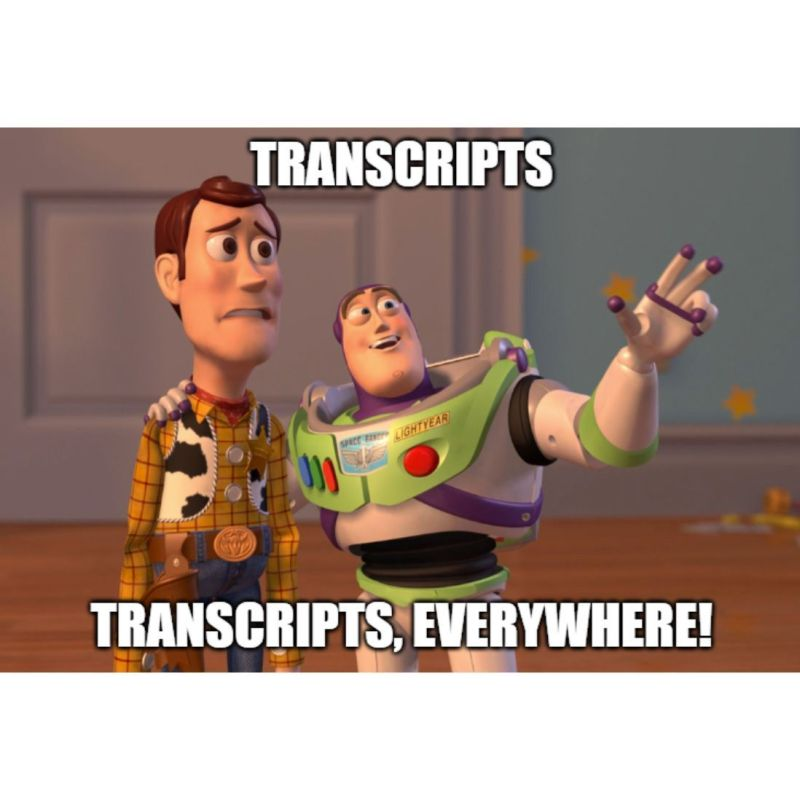

# **Análisis transcriptómico**

Esta carpeta contiene una serie de recursos y ejercicios que nos ayudarán a entender, diseñar e implementar el flujo de trabajo necesario para analizar datos RNAseq bulk.

