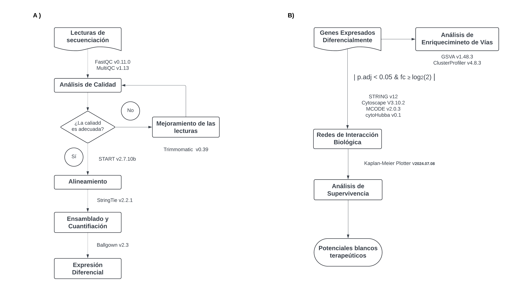
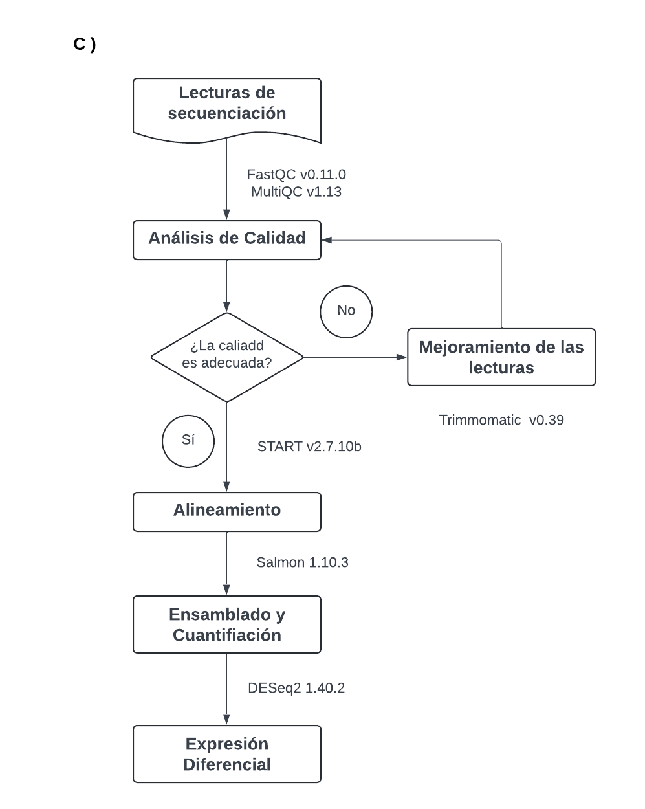

# **Transcriptoma UIVC**
### **Análisis de Macrófagos en el Microambiente Tumoral del Cáncer de Mama**

El ensamblaje del transcriptoma en un inicio se realizó utlizando [STAR](https://github.com/alexdobin/STAR?tab=readme-ov-file) como alineador, [StringTie](https://ccb.jhu.edu/software/stringtie/) como ensamblador y cuantificador de transcritos. La  expresión diferencial se realizó con [Ballgown](https://www.bioconductor.org/packages/devel/bioc/vignettes/ballgown/inst/doc/ballgown.html). 

La selección de estas herramientas para el ensamblaje del transcriptoma se basó en la sugerencia del Dr. Alfonso Méndez Tenorio del Instituto Politécnico Nacional (IPN). Las revisamos en la literatura y observamos que efectivamente son empleadas para el ensamblaje de transcriptomas y que gozaban de cierta popularidad y respaldo por parte de sus desarrolladores.

Durante los tutorales surgió la observación sobre la popularidad de estás herramientas, y con el paso del tiempo y experiencia en el área, notamos que en efecto no son las herramientas de consenso. Por ejemplo, [DESeq2](https://bioconductor.org/packages/release/bioc/html/DESeq2.html)  es más popular y empleada que [Ballgown]((https://www.bioconductor.org/packages/devel/bioc/vignettes/ballgown/inst/doc/ballgown.html)), de menos en nuestro campo de estudio.

Para resolver esta problemática, consulté cuáles herramientas podríamos emplear en lugar de [StringTie](https://ccb.jhu.edu/software/stringtie/) y [Ballgown](https://www.bioconductor.org/packages/devel/bioc/vignettes/ballgown/inst/doc/ballgown.html). Con base en los flujos de trabajo en [nf-core/rnaseq](https://nf-co.re/rnaseq/3.14.0/) y una revisión en la literatura, opté por trabajar con [Salmon](https://salmon.readthedocs.io/en/latest/) para el ensamblaje y  cuantificación de transcritos. 

